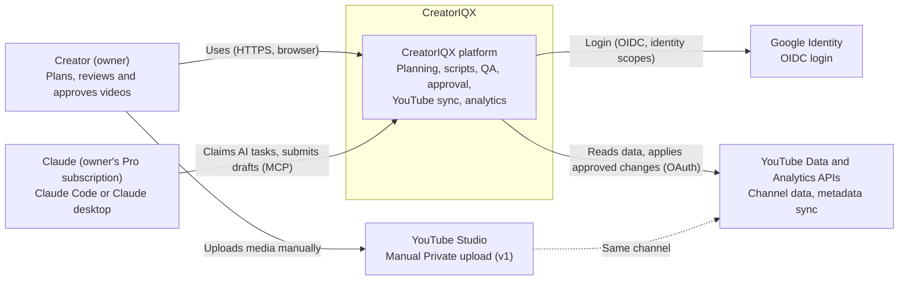
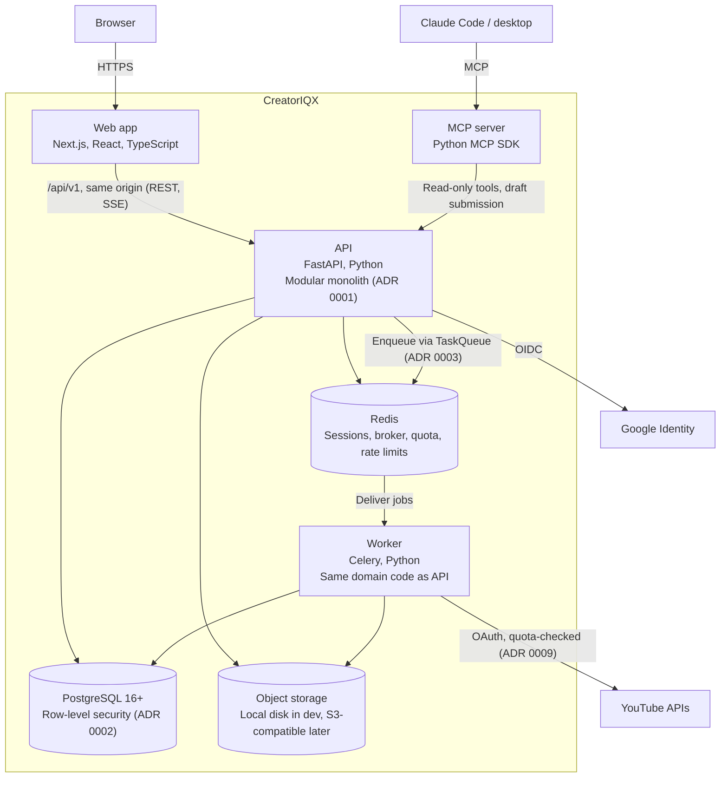
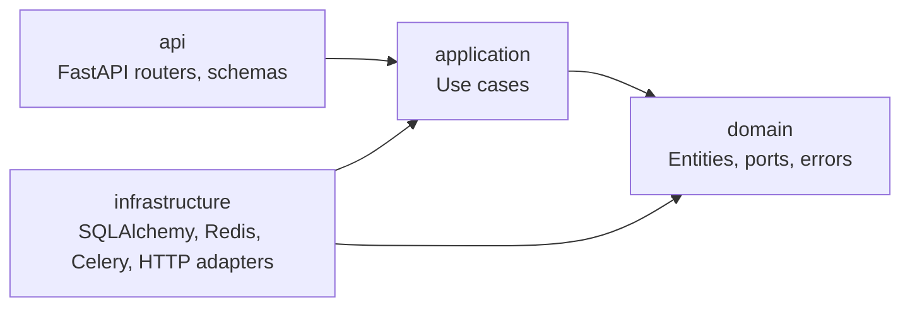
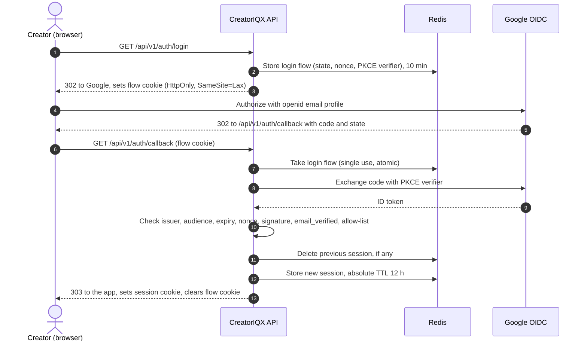
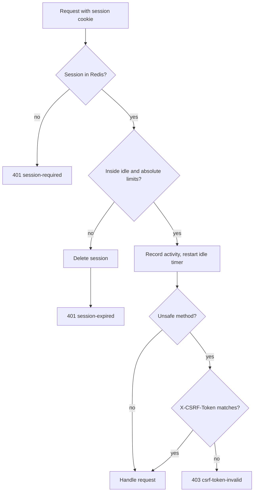
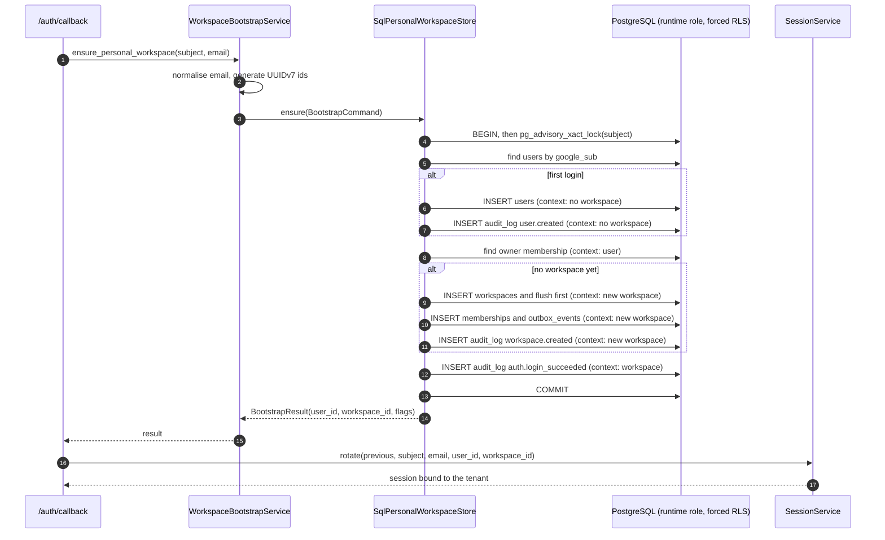
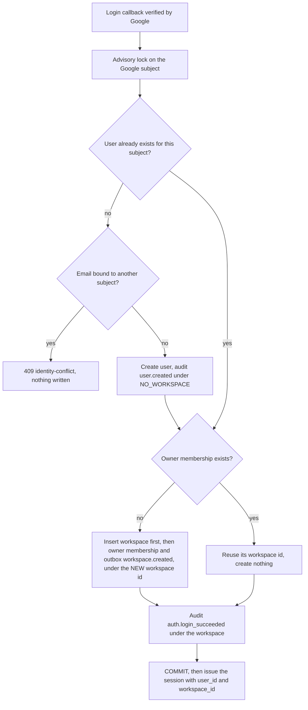
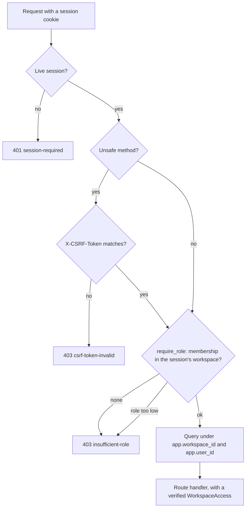
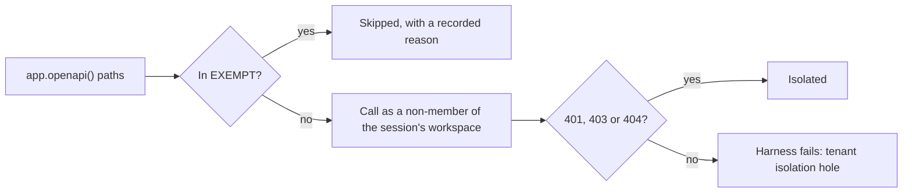

# CreatorIQX Architecture

How CreatorIQX is put together, in [C4](https://c4model.com/) terms. Decisions behind it are in [`docs/adr/`](adr/README.md). The spec (`CLAUDE.md` §3) is the source of truth; this document explains it and must change in the same pull request as any structural change.

## Level 1: System context

Who uses CreatorIQX and which outside systems it talks to.



| Element | Notes |
|---|---|
| Creator | The only user in v1; many creators, each in a workspace, from v2 |
| Claude | Runtime AI in v1 via the MCP bridge; it drafts, never publishes (ADR 0005) |
| Google Identity | Login only, `openid email profile` (ADR 0004) |
| YouTube APIs | Separate OAuth connection; every write capability gated by verified evidence (ADR 0007) |
| YouTube Studio | v1 media upload happens here, as Private (ADR 0007) |

## Level 2: Containers

The deployable pieces inside CreatorIQX and how they connect.



| Container | Responsibility | Key rules |
|---|---|---|
| Web app | UI; server-rendered shell; CSP with nonces | No business logic; calls the API only through the generated client |
| API | All business logic, organized by bounded context | Hexagonal layers per module; RLS context set per request |
| Worker | Background jobs: ingestion, sync, outbox relay, AI task leases | Jobs idempotent; same tenant context rules as the API |
| MCP server | Exposes app capabilities to the owner's Claude | Read-only by default; mutations only create drafts |
| PostgreSQL | System of record, including workflow state and audit log | Runtime role cannot bypass RLS or alter the audit log |
| Redis | Sessions, Celery broker, live quota counters, rate limits, progress pub/sub | Nothing here is the only copy of business state |
| Object storage | Thumbnails, transcripts files, media outputs | Behind a `StorageProvider` port; signed URLs |

**Open point:** whether the MCP server calls the API over HTTP (shown) or reads the database directly is decided by ADR when its first real tool is built (plan decision D11). The diagram shows the default.

## Level 3: Inside the API (module layout)

Each bounded context is a package with four layers. Arrows show allowed imports.



Bounded contexts (spec §3), added only when a ticket needs them: `identity`, `workspaces`, `youtube`, `intelligence`, `content`, `transcripts`, `qa`, `publishing`, `analytics`, `comments`, `experiments`, `recommendations`, `ai_gateway`, `jobs`, `workflows`, `notifications`, `telemetry`, `audit`.

## Request lifecycle (authenticated API call)

1. Browser calls `/api/v1/...` on the same origin; the session cookie identifies a server-side session in Redis.
2. Middleware assigns a correlation id, enforces CSRF on unsafe methods and rate limits.
3. The handler opens one transaction, sets `app.workspace_id` and `app.user_id` with `SET LOCAL`, and calls an application use case.
4. The use case checks the role (owner, editor, viewer), works through ports, and writes audit and outbox rows in the same transaction.
5. Errors map to RFC 9457 problem+json; logs are JSON with the correlation id and no secrets.

## Phase status

Phase 0 builds: web app shell, API skeleton, `identity` and `workspaces` modules (workspaces is the reference module, P0-053), `audit`, a minimal `jobs` port with one Celery job, PostgreSQL and Redis, CI. Everything else on this page arrives in later phases.

## Sign-in and session flows (P0-051)

How a creator signs in, and how each later request is checked. The rules are in [ADR 0010](adr/0010-server-side-sessions-and-csrf.md); the login provider is in [ADR 0004](adr/0004-oidc-login-separate-from-youtube-oauth.md).

### Sign-in sequence



### Checking each request



## First-login bootstrap (P0-053)

The first successful Google login creates the person, their personal workspace and the owner membership, in one transaction, before the session is issued. The rules are in [ADR 0011](adr/0011-workspace-bootstrap-at-first-login.md). Repeat logins resolve the same ids and create nothing.

### Bootstrap sequence



### Tenant context while bootstrapping



## Authorization on every request (P0-054)

One gate stands in front of tenant data. A route declares the role it needs; the
gate resolves the workspace and user from the session, re-checks membership, and
hands the route a verified `WorkspaceAccess`. The rules are in
[ADR 0012](adr/0012-rbac-in-the-application-layer-with-a-route-harness.md).



The two layers are independent on purpose. `require_role` refuses the request
before any work happens and can express a role requirement; row-level security
cannot express roles but stops a query that slips past the gate from reading
another tenant's rows.

### Why the harness enumerates routes

A per-route check is only as reliable as the next person adding a route, so the
cross-tenant harness reads the OpenAPI document rather than a list of routes. It
signs in a user whose session names workspace A while holding no membership there,
and requires every documented route to refuse. A route added later is covered as
soon as it appears; exempting one is an explicit entry with a reason, and a seeded
unprotected route is asserted to make the harness fail.



## Frontend foundation (P0-080)

`apps/web` is a Next.js App Router app, not yet any product screen. Spec
section 11's named UI screens (onboarding, the video board, the Video
Workspace, the approval diff, YouTube Sync) wait on P0-090's written
wireframe approval; this ticket is the app shell and design tokens those
screens will be built on, so it does not touch that gate.

Design tokens (color, the 8px spacing grid, type scale, radius, motion) are
CSS custom properties defined once in `src/app/globals.css`, each mapped to a
Tailwind v4 `@theme` utility (`bg-surface`, `text-ink`, ...). Light values
live on `:root`; dark values override the same properties under
`prefers-color-scheme: dark` (unless `data-theme="light"` is forced) and
under an explicit `data-theme="dark"`, so a component's class never changes
between themes — only what the token resolves to does. A component reaches
every color through a token utility; a lint rule
(`eslint.config.mjs`, `no-restricted-syntax` on hex-literal nodes) forbids a
raw hex literal anywhere in `src/**/*.ts(x)`, so the only way to add a color
is to add a token.

```mermaid
flowchart LR
    comp["Component className=\"bg-surface\""] --> theme["@theme: --color-surface: var(--surface)"]
    theme --> root[":root { --surface: #fff }"]
    theme --> dark["prefers-color-scheme: dark or data-theme=dark { --surface: #0b1220 }"]
    lint["eslint no-restricted-syntax"] -. blocks .-> hex["className=\"bg-[#4f46e5]\""]
```

`cn()` (`src/lib/utils.ts`, clsx + tailwind-merge) and `components.json` are
the shadcn/ui-style init; no component primitives exist yet (P0-083 adds
Button/Input/Card/Skeleton). `next.config.ts` rewrites `/api/*` to the local
FastAPI backend so the dev server runs on a single origin. The product name
comes from `@creatoriqx/config/product.json`, read by both this app and the
API, never hard-coded in either.
