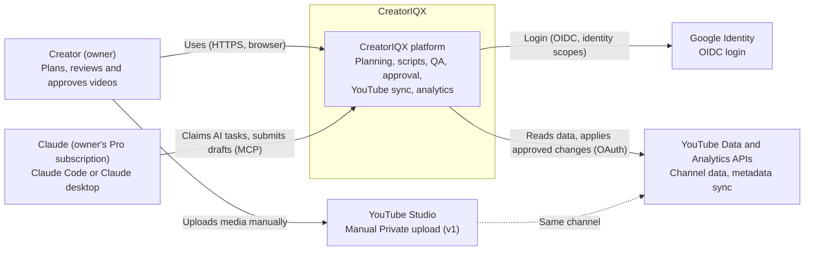
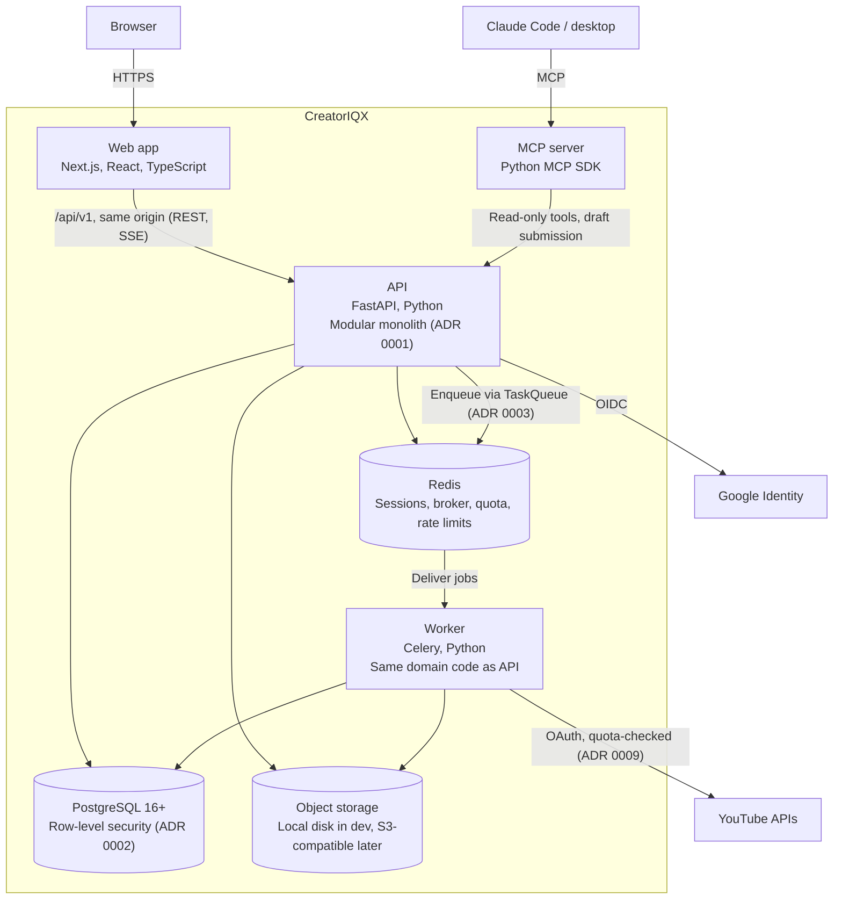
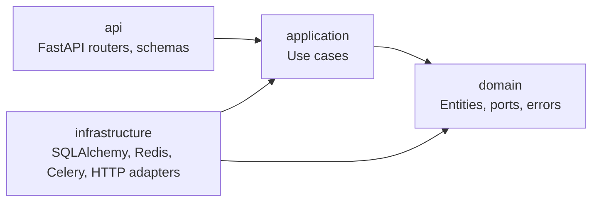

# CreatorIQX Architecture

How CreatorIQX is put together, in [C4](https://c4model.com/) terms. Decisions behind it are in [`docs/adr/`](adr/README.md). The spec (`CLAUDE.md` §3) is the source of truth; this document explains it and must change in the same pull request as any structural change.

## Level 1: System context

Who uses CreatorIQX and which outside systems it talks to.

| Element | Notes |
|---|---|
| Creator | The only user in v1; many creators, each in a workspace, from v2 |
| Claude | Runtime AI in v1 via the MCP bridge; it drafts, never publishes (ADR 0005) |
| Google Identity | Login only, `openid email profile` (ADR 0004) |
| YouTube APIs | Separate OAuth connection; every write capability gated by verified evidence (ADR 0007) |
| YouTube Studio | v1 media upload happens here, as Private (ADR 0007) |

## Level 2: Containers

The deployable pieces inside CreatorIQX and how they connect.

| Container | Responsibility | Key rules |
|---|---|---|
| Web app | UI; server-rendered shell; CSP with nonces | No business logic; calls the API only through the generated client |
| API | All business logic, organized by bounded context | Hexagonal layers per module; RLS context set per request |
| Worker | Background jobs: ingestion, sync, outbox relay, AI task leases | Jobs idempotent; same tenant context rules as the API |
| MCP server | Exposes app capabilities to the owner's Claude | Read-only by default; mutations only create drafts |
| PostgreSQL | System of record, including workflow state and audit log | Runtime role cannot bypass RLS or alter the audit log |
| Redis | Sessions, Celery broker, live quota counters, rate limits, progress pub/sub | Nothing here is the only copy of business state |
| Object storage | Thumbnails, transcripts files, media outputs | Behind a `StorageProvider` port; signed URLs |

**Open point:** whether the MCP server calls the API over HTTP (shown) or reads the database directly is decided by ADR when its first real tool is built (plan decision D11). The diagram shows the default.

## Level 3: Inside the API (module layout)

Each bounded context is a package with four layers. Arrows show allowed imports.

Bounded contexts (spec §3), added only when a ticket needs them: `identity`, `workspaces`, `youtube`, `intelligence`, `content`, `transcripts`, `qa`, `publishing`, `analytics`, `comments`, `experiments`, `recommendations`, `ai_gateway`, `jobs`, `workflows`, `notifications`, `telemetry`, `audit`.

## Request lifecycle (authenticated API call)

1. Browser calls `/api/v1/...` on the same origin; the session cookie identifies a server-side session in Redis.
2. Middleware assigns a correlation id, enforces CSRF on unsafe methods and rate limits.
3. The handler opens one transaction, sets `app.workspace_id` and `app.user_id` with `SET LOCAL`, and calls an application use case.
4. The use case checks the role (owner, editor, viewer), works through ports, and writes audit and outbox rows in the same transaction.
5. Errors map to RFC 9457 problem+json; logs are JSON with the correlation id and no secrets.

## Phase status

Phase 0 builds: web app shell, API skeleton, `identity` and `workspaces` modules, `audit`, a minimal `jobs` port with one Celery job, PostgreSQL and Redis, CI. Everything else on this page arrives in later phases.
