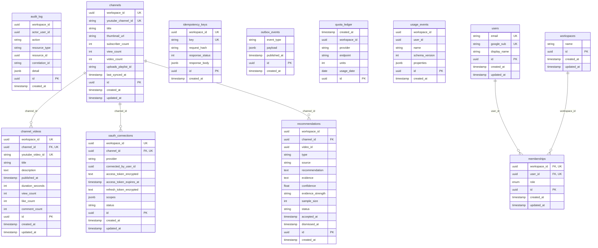

# CreatorIQX Data Model

> **Generated by `scripts/generate_erd.py`** from the SQLAlchemy metadata (spec §7, §17).
> Do not hand-edit the diagram or the tables below; run the script again after
> adding or changing a table. CI fails if this file is stale.

## Purpose

The entity-relationship diagram (Mermaid), generated from the SQLAlchemy
metadata and never hand-drawn (spec §7, §17), plus the owning bounded
context of every table and the list of global (non-tenant) tables.

## Entity-relationship diagram

## Table ownership

Every table has exactly one owning bounded context (spec §3); other modules
read it only through that module's public interface or domain events.

| Table | Owning module | Tenant-scoped (`workspace_id`) |
|---|---|---|
| `audit_log` | audit | yes |
| `channel_videos` | youtube | yes |
| `channels` | youtube | yes |
| `idempotency_keys` | jobs | yes |
| `memberships` | workspaces | yes |
| `oauth_connections` | youtube | yes |
| `outbox_events` | jobs | no |
| `quota_ledger` | youtube | yes |
| `recommendations` | intelligence | yes |
| `usage_events` | telemetry | yes |
| `users` | identity | no |
| `workspaces` | workspaces | no |

## Global (non-tenant) tables

Tables with no `workspace_id` column. These sit outside row-level security
by design (spec §6): either they are global identity (`users`) or a platform
table that must be read across every tenant (`outbox_events`, read by the
relay worker).

- `outbox_events`
- `users`
- `workspaces`
