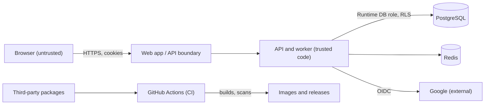

# CreatorIQX Security

Security model and threat model. Target: OWASP ASVS Level 2, OWASP Top 10, OWASP Top 10 for LLM Applications (spec §10). The threat model is reviewed at every phase gate.

| Field | Value |
|---|---|
| Version | STRIDE v0 (Phase 0 scope) |
| Date | 2026-10-08 |
| Reviewed at | Phase 0 planning; next review at the Phase 0 gate (P0-110) |

## Reporting a vulnerability

The project is pre-release. Report suspected issues privately to the owner; do not open a public issue.

## Scope of v0

Phase 0 assets and entry points only: Google OIDC login, server-side sessions, workspaces and memberships with RLS, the audit log, the job queue, CI and the supply chain, secrets handling, and the test-only identity stub. YouTube tokens, AI tasks and uploads enter the model in Phase 1A and later.

## Assets

| Asset | Why it matters |
|---|---|
| Sessions | A stolen session is the user's whole account |
| Workspace data | Must never cross tenants |
| Audit log | Evidence of who did what; must be tamper-resistant |
| OAuth client secrets, session signing and encryption keys | Compromise enables impersonation |
| CI pipeline and dependencies | A poisoned build ships attacker code |

## Trust boundaries

## STRIDE threats (v0)

Ratings: High, Medium, Low (likelihood and impact combined). Every High threat names the ticket or test that controls it.

| ID | Category | Threat | Rating | Control | Ticket or test |
|---|---|---|---|---|---|
| T-S1 | Spoofing | Attacker forges or replays an OIDC response (CSRF on callback, ID token replay, token issued for another app) | High | PKCE, `state` and `nonce` checks; ID token issuer, audience, expiry and signature validated against Google JWKS | P0-050 (tests for bad state, bad nonce, wrong audience, expired token) |
| T-S2 | Spoofing | Any Google account signs in to a single-user v1 install | High | `email_verified` required; email allow-list `AUTH_ALLOWED_EMAILS` | P0-050 (allow-list and unverified-email tests) |
| T-S3 | Spoofing | Session fixation: attacker plants a session id before login | High | Session id rotated on login; old id invalidated | P0-051 (rotation and reuse tests) |
| T-S4 | Spoofing | Test-only identity stub reachable in production | High | Stub exists only when `APP_ENV=test`; production config cannot import it | P0-103 (production-config test) |
| T-T1 | Tampering | Cross-site request forgery on state-changing endpoints | High | CSRF token on unsafe methods; SameSite cookies; same-origin only | P0-051 (missing-token test), P0-032 (CORS) |
| T-T2 | Tampering | Audit log rows edited or deleted to hide actions | High | Runtime role has no UPDATE or DELETE; trigger rejects them | P0-043 (append-only test) |
| T-T3 | Tampering | Malicious or compromised dependency or action in CI | High | Lockfiles with frozen installs; pinned action versions; Dependabot; dependency audit; Trivy; CodeQL | P0-010, P0-101, P0-102 |
| T-T4 | Tampering | Lost update when two edits race | Low | Optimistic concurrency `version` column (later aggregates) | P0-040 (mixin) |
| T-R1 | Repudiation | User denies a sensitive action (login, workspace creation, later approvals) | Medium | Audit entries with actor, workspace, correlation id and time for every sensitive action | P0-053 (audit rows) |
| T-I1 | Information disclosure | A query reads another workspace's rows | High | Forced RLS on every tenant table; runtime role `NOBYPASSRLS`; tenant context per transaction with `SET LOCAL` | P0-042 (RLS meta-test), P0-054 (cross-tenant harness on every route) |
| T-I2 | Information disclosure | Tokens, cookies or secrets written to logs | High | Log redaction of authorization, cookie and token-like fields | P0-031 (redaction test) |
| T-I3 | Information disclosure | Secrets committed to the repo or shared outside secret stores | High | `.gitignore` for `.env`; gitleaks in pre-commit and CI (blocking); secrets only in env vars; exposed secrets rotated | P0-013, P0-102; OQ-15 (rotation of a secret shared in chat) |
| T-I4 | Information disclosure | Stack traces or internals in error responses | Medium | RFC 9457 problem+json without internals | P0-031 |
| T-I5 | Information disclosure | Clickjacking, MIME sniffing, mixed content | Medium | Security headers; CSP with nonces; HSTS when HTTPS | P0-032, P0-082 |
| T-D1 | Denial of service | Login or callback endpoints flooded | Medium | Redis token-bucket rate limits per IP and user (deferred to start of 1A under time-box Option B; required before any hosted exposure in 1E) | P0-055 |
| T-D2 | Denial of service | Oversized request bodies exhaust memory | Medium | Request body size limit | P0-032 |
| T-D3 | Denial of service | Job retries storm the queue | Low | Bounded retries with exponential backoff and jitter | P0-060 |
| T-E1 | Elevation of privilege | Viewer or editor performs owner-only actions | High | Role checks in the application layer, RLS as backstop | P0-054 (RBAC dependency and harness) |
| T-E2 | Elevation of privilege | App database role runs DDL or bypasses RLS | High | Separate owner and runtime roles; runtime role owns no tables | P0-020 (role test) |
| T-E3 | Elevation of privilege | First-login bootstrap path used to create data in another workspace | Medium | Workspace id generated in the app, set as RLS context before insert; no privileged bypass path | P0-053 |

## Accepted risks (v0)

| Risk | Why accepted for now | Revisit |
|---|---|---|
| Local development over `http://localhost` | Browsers treat localhost as a secure context (verify per browser, OQ-10); fallback to local TLS exists | P0-051 |
| OAuth app in Google "Testing" status | Single user; token expiry handled by reconnect flow | Phase 1A, Phase 5 (verification) |
| Rate limiting deferred to 1A | Nothing is exposed beyond the developer's machine in Phase 0 | Start of 1A |

## Phase 1A additions (preview)

YouTube token encryption at rest (AES-256-GCM, envelope encryption, key rotation), token lifecycle audit events, SSRF allow-list for outbound fetches, quota exhaustion as a denial-of-service vector, prompt injection through comments and transcripts (OWASP LLM01).
